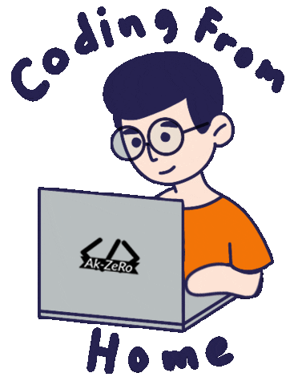

<h1 align="center">Hey 👋, I'm Abdulrahman Alkurdi</h1>

###

  

###

  
 
  
 
  
 
  
 
  
 
  
 
  
 
  
 
  
 
  
 
  

###

###

<h3 align="left">👩‍💻 About Me</h3>

###

  - 🔭 I’m working as Fullstack Developer  - 📚 I'm currently learning
  ... - ⚡ In my free time I am playing online games or reading

###

<h3 align="left">🛠 Language and tools</h3>

###

  

  
  

   
  

   
  

   
  

   
  

   
  

   
  

   
  

   
  

   
  

   
  

   
  

   
  

   
  

   
  

   
  

   
  

   
  

   
  

   
  

   
  

   
  

   
  

###

<h3 align="left">🔥 My Stats :</h3>

###

  

###

  
  
  

###

 

  

###

  

###
